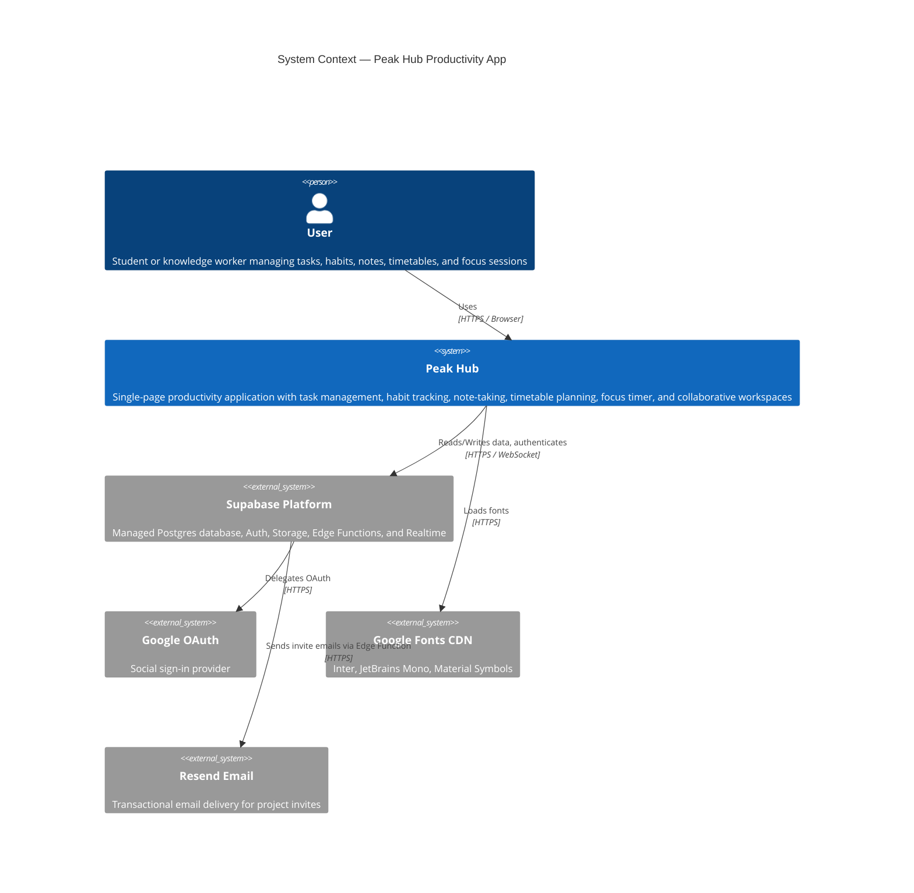
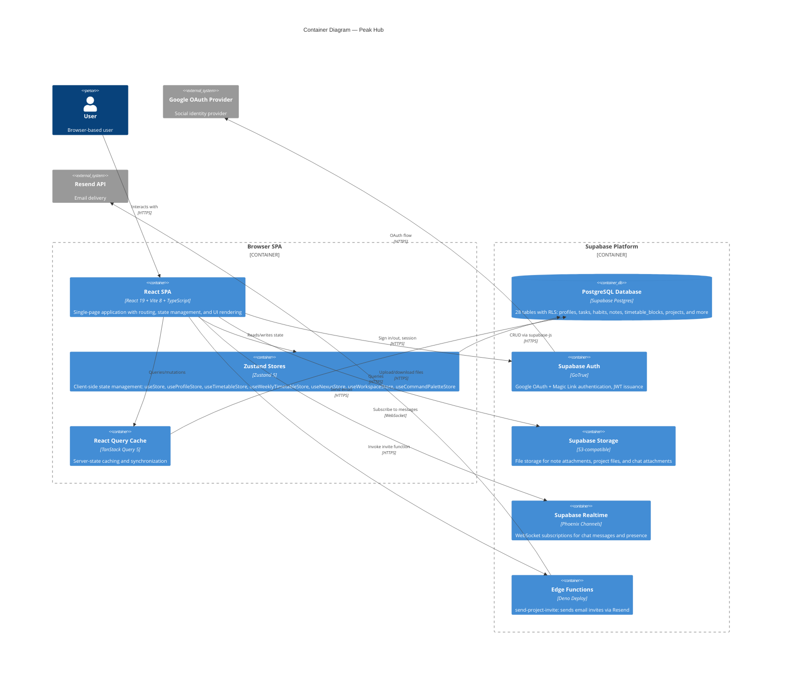
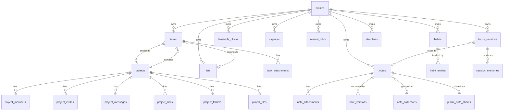
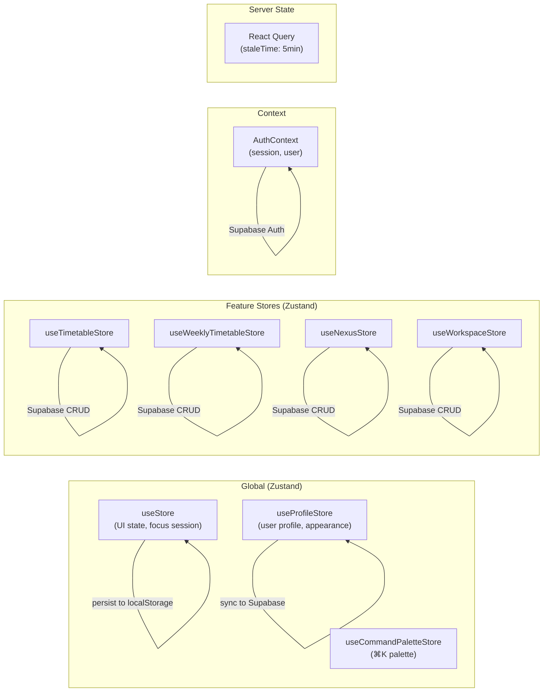

# ARCHITECTURE.md — System Architecture

> C4 Model representation of the Peak Hub productivity application.
> Levels 1 (System Context) and 2 (Container) diagrams.

---

## 1. System Context (C4 Level 1)

Shows how Peak Hub fits into its broader ecosystem of users and external services.

---

## 2. Container Diagram (C4 Level 2)

Shows the major runtime containers and how they communicate.

---

## 3. Data Model Overview

### Core Entity Groups

### Database Tables (28 total, all with RLS enabled)

| Domain | Tables |
|---|---|
| **User** | `profiles` |
| **Tasks** | `tasks`, `task_attachments`, `lists` |
| **Habits** | `habits`, `habit_entries` |
| **Notes (Nexus)** | `notes`, `note_attachments`, `note_versions`, `note_templates`, `note_collections`, `note_collection_items`, `nexus_tags`, `public_note_shares` |
| **Focus** | `focus_sessions`, `session_memories`, `mental_inbox`, `captures` |
| **Timetable** | `timetable_blocks`, `template_blocks` (legacy), `scheduled_entries` (legacy), `deadlines` |
| **Workspace** | `projects`, `project_members`, `project_invites`, `project_messages`, `project_docs`, `project_folders`, `project_files` |

---

## 4. Feature ↔ Route Mapping

| Route | Feature Module | Page Component | Key Stores |
|---|---|---|---|
| `/` | tasks, lists, inbox, timer | `TodayPage` | `useStore` |
| `/habits` | habits | `HabitsPage` | feature store |
| `/timetable` | timetable | `TimetablePage` | `useTimetableStore`, `useWeeklyTimetableStore` |
| `/nexus` | nexus | `NexusView` | `useNexusStore` |
| `/workspace` | workspace | `WorkspacePage` | `useWorkspaceStore` |
| `/workspace/:id` | workspace | `WorkspacePage` | `useWorkspaceStore` |
| `/login` | — | `LoginPage` | `useAuth` |
| `/share/:slug` | nexus | `PublicNotePage` | — |
| `/invite/:token` | workspace | `InviteAcceptPage` | `useWorkspaceStore` |

---

## 5. State Management Architecture

All Zustand stores that interact with Supabase implement **optimistic updates with rollback**.
