# DATABASE.md — Schema Documentation

> Complete database reference for Peak Hub. 28 tables across 7 domains, all with RLS enabled.
> Source of truth: live Supabase Postgres introspection (July 2026).

---

## 1. Entity Relationship Diagram

```mermaid
erDiagram
    %% ── User Domain ──
    profiles {
        uuid id PK
        text display_name
        text username UK
        text accent_color
        boolean compact_mode
        text theme
        timestamptz created_at
        timestamptz updated_at
    }

    %% ── Task Domain ──
    tasks {
        uuid id PK
        uuid user_id FK
        text title
        text description
        boolean completed
        timestamptz due_date
        timestamptz created_at
        timestamptz updated_at
        uuid list_id FK
        boolean is_priority
        timestamptz completed_at
        text status
        uuid project_id FK
        uuid assigned_to FK
        uuid created_by FK
        uuid folder_id FK
    }

    task_attachments {
        uuid id PK
        uuid task_id FK
        uuid user_id FK
        text type
        text name
        text url
        text storage_path
        integer size
        timestamptz created_at
    }

    lists {
        uuid id PK
        uuid user_id FK
        text name
        text icon
        text color
        timestamptz created_at
        integer position
    }

    %% ── Habit Domain ──
    habits {
        uuid id PK
        uuid user_id FK
        text name
        text color
        integer position
        boolean archived
        timestamptz created_at
    }

    habit_entries {
        uuid id PK
        uuid habit_id FK
        date completed_date
        timestamptz created_at
    }

    %% ── Focus Domain ──
    focus_sessions {
        uuid id PK
        uuid user_id FK
        integer duration_minutes
        uuid task_id FK
        timestamptz created_at
        text intention
        text completion_state
        text reflection
        integer parked_thought_count
        timestamptz started_at
        timestamptz ends_at
    }

    mental_inbox {
        uuid id PK
        uuid user_id FK
        text content
        text source
        uuid linked_task_id FK
        uuid linked_focus_session_id FK
        uuid space_id FK
        timestamptz resolved_at
        text status
        timestamptz created_at
    }

    captures {
        uuid id PK
        uuid user_id FK
        text content
        timestamptz created_at
    }

    session_memories {
        uuid id PK
        uuid linked_note_id FK
        uuid focus_session_id FK "UK"
        integer duration
        text summary
        timestamptz created_at
    }

    %% ── Notes / Nexus Domain ──
    notes {
        uuid id PK
        uuid user_id FK
        text title
        text content
        text type
        text_arr tags
        uuid linked_session_id FK
        timestamptz created_at
        timestamptz updated_at
        boolean is_pinned
        boolean is_archived
        text cover_image
        date daily_date
    }

    note_attachments {
        uuid id PK
        uuid note_id FK
        text file_name
        text file_url
        text file_type
        timestamptz created_at
        text storage_path
        integer size
    }

    note_versions {
        uuid id PK
        uuid note_id FK
        uuid user_id FK
        text title_snapshot
        text content_snapshot
        text_arr tags_snapshot
        text type_snapshot
        timestamptz created_at
    }

    note_templates {
        uuid id PK
        uuid user_id FK
        text title
        text description
        text icon
        text category
        text content
        boolean is_system_template
        timestamptz created_at
        timestamptz updated_at
    }

    note_collections {
        uuid id PK
        uuid user_id FK
        text name
        text icon
        timestamptz created_at
    }

    note_collection_items {
        uuid id PK
        uuid collection_id FK
        uuid note_id FK
    }

    nexus_tags {
        uuid id PK
        uuid user_id FK
        text name
        timestamptz created_at
    }

    public_note_shares {
        uuid id PK
        uuid note_id FK "UK"
        text public_slug UK
        boolean is_public
        timestamptz created_at
        timestamptz updated_at
    }

    %% ── Timetable Domain ──
    timetable_blocks {
        uuid id PK
        uuid user_id FK
        text name
        text category
        text color
        integer day
        integer start_hour
        integer duration
        timestamptz created_at
        boolean archived
        text notes
    }

    template_blocks {
        uuid id PK
        uuid user_id FK
        text name
        text category
        text color
        integer start_slot
        integer duration_slots
        int_arr repeat_days
        timestamptz created_at
        boolean archived
    }

    scheduled_entries {
        uuid id PK
        uuid user_id FK
        uuid task_id FK
        text name
        text category
        text color
        date scheduled_date
        integer start_slot
        integer duration_slots
        timestamptz created_at
    }

    deadlines {
        uuid id PK
        uuid user_id FK
        text name
        date date
        text color
        text notes
        timestamptz created_at
    }

    %% ── Workspace / Projects Domain ──
    projects {
        uuid id PK
        text name
        text description
        text color
        text icon
        uuid owner_id FK
        text invite_code UK
        boolean invite_enabled
        timestamptz created_at
        boolean archived
    }

    project_members {
        uuid id PK
        uuid project_id FK
        uuid user_id FK
        text role
        timestamptz joined_at
    }

    project_invites {
        uuid id PK
        uuid project_id FK
        text invited_email
        uuid invited_by FK
        text role
        text token UK
        boolean accepted
        timestamptz created_at
        timestamptz expires_at
    }

    project_messages {
        uuid id PK
        uuid project_id FK
        uuid user_id FK
        text content
        timestamptz edited_at
        boolean deleted
        timestamptz created_at
        jsonb attachments
    }

    project_docs {
        uuid id PK
        uuid project_id FK
        text title
        text content
        uuid created_by FK
        uuid last_edited_by FK
        timestamptz created_at
        timestamptz updated_at
    }

    project_folders {
        uuid id PK
        uuid project_id FK
        uuid parent_id FK
        text name
        uuid created_by FK
        timestamptz created_at
    }

    project_files {
        uuid id PK
        uuid project_id FK
        uuid folder_id FK
        uuid uploaded_by FK
        text name
        integer size
        text mime_type
        text storage_path
        timestamptz created_at
    }

    %% ── Relationships ──
    profiles ||--o{ tasks : "owns"
    profiles ||--o{ habits : "owns"
    profiles ||--o{ notes : "owns"
    profiles ||--o{ lists : "owns"
    profiles ||--o{ captures : "owns"
    profiles ||--o{ focus_sessions : "owns"
    profiles ||--o{ mental_inbox : "owns"
    profiles ||--o{ timetable_blocks : "owns"
    profiles ||--o{ template_blocks : "owns"
    profiles ||--o{ deadlines : "owns"
    profiles ||--o{ note_collections : "owns"
    profiles ||--o{ nexus_tags : "owns"
    profiles ||--o{ note_templates : "owns"
    profiles ||--o{ projects : "owns"

    tasks ||--o{ task_attachments : "has"
    tasks }o--o| lists : "belongs to"
    tasks }o--o| projects : "scoped to"
    tasks }o--o| project_folders : "filed in"

    habits ||--o{ habit_entries : "tracked by"

    focus_sessions }o--o| tasks : "linked to"
    focus_sessions ||--o| session_memories : "produces"

    mental_inbox }o--o| tasks : "linked to"
    mental_inbox }o--o| focus_sessions : "captured during"
    mental_inbox }o--o| lists : "triaged to"

    notes ||--o{ note_attachments : "has"
    notes ||--o{ note_versions : "versioned by"
    notes ||--o| public_note_shares : "shared via"
    notes }o--o| focus_sessions : "linked to"

    note_collections ||--o{ note_collection_items : "contains"
    note_collection_items }o--|| notes : "references"

    session_memories }o--|| notes : "linked to"

    scheduled_entries }o--o| tasks : "schedules"

    projects ||--o{ project_members : "has"
    projects ||--o{ project_invites : "has"
    projects ||--o{ project_messages : "has"
    projects ||--o{ project_docs : "has"
    projects ||--o{ project_folders : "has"
    projects ||--o{ project_files : "has"
    projects ||--o{ tasks : "contains"

    project_folders ||--o{ project_files : "contains"
    project_folders ||--o{ project_folders : "nests"

    project_members }o--|| profiles : "is"
    project_invites }o--|| profiles : "invited by"
```

---

## 2. Data Dictionary

### 2.1 User Domain

#### `profiles`
**Purpose:** Stores user identity and appearance preferences. Created on first sign-in (auto-inserted by the client if missing). Linked 1:1 with `auth.users`.

| Column | Type | Nullable | Default | Description |
|---|---|---|---|---|
| `id` | uuid | NO | — | PK, FK → `auth.users.id` |
| `display_name` | text | YES | — | User's display name |
| `username` | text | YES | — | Unique handle (lowercase, 2–30 chars) |
| `accent_color` | text | YES | `'#534AB7'` | User-chosen accent color hex |
| `compact_mode` | boolean | YES | `false` | Reduces UI padding globally |
| `theme` | text | YES | `'dark'` | `'dark'`, `'light'`, or `'system'` |
| `created_at` | timestamptz | YES | `now()` | — |
| `updated_at` | timestamptz | YES | `now()` | — |

**Relationships:** One-to-many with nearly every user-owned table. Also referenced by `project_members` and `project_invites` for workspace collaboration.

---

### 2.2 Task Domain

#### `tasks`
**Purpose:** Core task entity. Tasks can be personal (user-owned) or project-scoped (collaborative). Supports priority flagging, due dates, scheduling status, list/space grouping, and project folder organization.

| Column | Type | Nullable | Default | Description |
|---|---|---|---|---|
| `id` | uuid | NO | `gen_random_uuid()` | PK |
| `user_id` | uuid | NO | — | FK → `auth.users.id` |
| `title` | text | NO | — | Task title |
| `description` | text | YES | — | Rich-text description |
| `completed` | boolean | YES | `false` | Completion flag |
| `due_date` | timestamptz | YES | — | Optional deadline |
| `list_id` | uuid | YES | — | FK → `lists.id` (space grouping) |
| `is_priority` | boolean | YES | `false` | Priority flag |
| `completed_at` | timestamptz | YES | — | When marked complete |
| `status` | text | YES | `'unscheduled'` | `'unscheduled'` or `'scheduled'` |
| `project_id` | uuid | YES | — | FK → `projects.id` |
| `assigned_to` | uuid | YES | — | FK → `auth.users.id` |
| `created_by` | uuid | YES | — | FK → `auth.users.id` |
| `folder_id` | uuid | YES | — | FK → `project_folders.id` |

**Relationships:** Many-to-one with `lists`, `projects`, `project_folders`. One-to-many with `task_attachments`, `scheduled_entries`, `focus_sessions`, `mental_inbox`.

#### `task_attachments`
**Purpose:** File attachments on tasks (links or uploaded files).

**Relationships:** Many-to-one with `tasks` and `auth.users`.

#### `lists`
**Purpose:** User-defined grouping containers ("spaces") for organizing tasks. Support custom icons, colors, and ordering.

**Relationships:** One-to-many with `tasks` and `mental_inbox`.

---

### 2.3 Habit Domain

#### `habits`
**Purpose:** Defines a trackable habit (e.g., "Meditate", "Read"). Supports soft-delete via `archived` and manual ordering via `position`.

| Column | Type | Nullable | Default | Description |
|---|---|---|---|---|
| `id` | uuid | NO | `gen_random_uuid()` | PK |
| `user_id` | uuid | NO | — | FK → `auth.users.id` |
| `name` | text | NO | — | Habit label |
| `color` | text | NO | — | Display color hex |
| `position` | integer | NO | `0` | Sort order |
| `archived` | boolean | NO | `false` | Soft delete |

**Relationships:** One-to-many with `habit_entries`.

#### `habit_entries`
**Purpose:** Records a single daily completion of a habit. The composite unique constraint `(habit_id, completed_date)` prevents double-marking.

**Relationships:** Many-to-one with `habits`.

---

### 2.4 Focus Domain

#### `focus_sessions`
**Purpose:** Records a timed focus work session. Tracks intention, duration, linked task, completion state, and reflection notes.

| Column | Type | Nullable | Default | Description |
|---|---|---|---|---|
| `id` | uuid | NO | `gen_random_uuid()` | PK |
| `user_id` | uuid | NO | — | FK → `auth.users.id` |
| `duration_minutes` | integer | NO | — | Planned duration |
| `task_id` | uuid | YES | — | FK → `tasks.id` |
| `intention` | text | YES | — | Session goal statement |
| `completion_state` | text | YES | — | `'completed'` or `'interrupted'` |
| `reflection` | text | YES | — | Post-session reflection |
| `parked_thought_count` | integer | YES | `0` | Mental inbox captures during session |
| `started_at` | timestamptz | YES | — | Actual start time |
| `ends_at` | timestamptz | YES | — | Expected end time |

**Relationships:** Many-to-one with `tasks`. One-to-one with `session_memories`. One-to-many with `mental_inbox`, `notes`.

#### `mental_inbox`
**Purpose:** "Parking lot" for thoughts captured during focus sessions or via quick capture. Thoughts can be triaged to a task, resolved, or converted to a task.

| Column | Type | Notable | Description |
|---|---|---|---|
| `source` | text | CHECK | `'focus'`, `'quick_capture'`, or `'manual'` |
| `status` | text | CHECK | `'unresolved'`, `'resolved'`, or `'converted_to_task'` |
| `linked_task_id` | uuid | FK | Task created from this thought |
| `linked_focus_session_id` | uuid | FK | Session during which it was captured |
| `space_id` | uuid | FK → `lists.id` | Triage destination |

#### `captures`
**Purpose:** Lightweight quick-capture entries (one-liner thoughts). Simpler than `mental_inbox`.

#### `session_memories`
**Purpose:** Links a focus session to a note, creating a "memory" of the work done. One-to-one with `focus_sessions` (enforced by unique constraint on `focus_session_id`).

---

### 2.5 Notes / Nexus Domain

#### `notes`
**Purpose:** The core note entity powering the "Nexus" editor. Supports markdown content, tags, daily journal entries, pinning, archiving, cover images, and linking to focus sessions.

| Column | Type | Notable | Description |
|---|---|---|---|
| `type` | text | NOT NULL, default `'standard'` | `'standard'`, `'daily'`, etc. |
| `tags` | text[] | default `'{}'` | Array of tag strings |
| `daily_date` | date | Partial unique index | For daily journal notes |
| `linked_session_id` | uuid | FK → `focus_sessions.id` | Auto-generated session notes |
| `is_pinned` | boolean | default `false` | Pin to top |
| `is_archived` | boolean | default `false` | Soft archive |
| `cover_image` | text | nullable | URL to cover image |

**Relationships:** One-to-many with `note_attachments`, `note_versions`. One-to-one with `public_note_shares`. Many-to-many with `note_collections` (via `note_collection_items`).

#### `note_versions`
**Purpose:** Point-in-time snapshots of a note for version history. Stores title, content, tags, and type at the time of snapshot.

#### `note_attachments`
**Purpose:** File attachments embedded in notes (images, documents).

#### `note_templates`
**Purpose:** Reusable note templates. Can be system-wide (`is_system_template = true`, visible to all) or user-created. System templates cannot be modified by users (enforced by RLS).

#### `note_collections`
**Purpose:** Named folders/notebooks for grouping notes.

#### `note_collection_items`
**Purpose:** Junction table implementing many-to-many between `notes` and `note_collections`. Unique constraint on `(collection_id, note_id)` prevents duplicates.

#### `nexus_tags`
**Purpose:** User-scoped tag definitions. Unique per user via `(user_id, name)` constraint.

#### `public_note_shares`
**Purpose:** Makes a note publicly accessible via a unique slug URL (`/share/:slug`). One-to-one with `notes` (unique on `note_id`).

---

### 2.6 Timetable Domain

#### `timetable_blocks` (current)
**Purpose:** Recurring weekly schedule blocks in a 24-hour × 7-day grid. This is the **active** timetable system.

| Column | Type | Notable | Description |
|---|---|---|---|
| `day` | integer | CHECK 0–6 | 0=Monday, 6=Sunday |
| `start_hour` | integer | CHECK 0–23 | Hour of day |
| `duration` | integer | CHECK 1–24 | Block length in hours |
| `category` | text | NOT NULL | sleep, class, work, health, etc. |
| `archived` | boolean | default `false` | Soft delete |

#### `template_blocks` ⚠️ LEGACY
**Purpose:** Slot-based timetable blocks from the original day-view system. Retained for backward compatibility but superseded by `timetable_blocks`.

#### `scheduled_entries` ⚠️ LEGACY
**Purpose:** Date-specific scheduled entries from the legacy day-view. Links tasks to specific dates/time-slots. Superseded by `timetable_blocks`.

#### `deadlines`
**Purpose:** Standalone deadline markers displayed on the timetable week view. Independent of tasks.

---

### 2.7 Workspace / Projects Domain

#### `projects`
**Purpose:** Collaborative workspace containers. Support team membership, real-time chat, shared docs, file storage, and project-scoped tasks.

| Column | Type | Notable | Description |
|---|---|---|---|
| `invite_code` | text | UNIQUE, auto-generated | Shareable join code |
| `invite_enabled` | boolean | default `false` | Whether invite code is active |
| `archived` | boolean | default `false` | Soft archive |

#### `project_members`
**Purpose:** Junction table between `projects` and `profiles`. Unique on `(project_id, user_id)`.

| Column | Notable | Description |
|---|---|---|
| `role` | CHECK | `'owner'`, `'member'`, or `'viewer'` |

#### `project_invites`
**Purpose:** Pending email invitations. Auto-expire after 7 days. Token-based acceptance flow.

| Column | Notable | Description |
|---|---|---|
| `token` | UNIQUE | One-time accept token |
| `role` | CHECK | Role granted upon acceptance |
| `expires_at` | default `now() + 7 days` | Auto-expiry |

#### `project_messages`
**Purpose:** Real-time chat messages within a project. Supports soft-delete and JSONB attachments.

| Column | Notable | Description |
|---|---|---|
| `content` | CHECK `char_length > 0` | Non-empty message body |
| `attachments` | jsonb, default `'[]'` | Array of `{name, path, type, size}` |
| `deleted` | boolean | Soft delete (content hidden but row retained) |

#### `project_docs`
**Purpose:** Collaborative documents within a project. Tracks creator and last editor.

#### `project_folders`
**Purpose:** Hierarchical folder structure for organizing project files. Self-referencing `parent_id` enables nesting. Unique on `(project_id, parent_id, name)`.

#### `project_files`
**Purpose:** Uploaded files within a project, stored in Supabase Storage. Linked to optional folders.

---

## 3. Indexes

### 3.1 Performance Indexes (non-PK, non-unique)

| Table | Index Name | Columns | Purpose |
|---|---|---|---|
| `deadlines` | `idx_deadlines_user_date` | `(user_id, date)` | Week-range deadline queries |
| `habit_entries` | `idx_habit_entries_habit_date` | `(habit_id, completed_date)` | Streak calculation lookups |
| `project_docs` | `project_docs_project_id_updated_at_idx` | `(project_id, updated_at)` | Recent docs listing |
| `project_files` | `idx_project_files_lookup` | `(project_id, folder_id)` | File browser queries |
| `project_folders` | `idx_project_folders_lookup` | `(project_id, parent_id)` | Folder tree traversal |
| `project_members` | `idx_project_members_project_id` | `(project_id)` | Member listing |
| `project_members` | `idx_project_members_user_id` | `(user_id)` | "My projects" lookup |
| `project_messages` | `project_messages_project_id_created_at_idx` | `(project_id, created_at)` | Chat history pagination |
| `project_messages` | `project_messages_user_id_idx` | `(user_id)` | User's messages |
| `public_note_shares` | `public_note_shares_slug_idx` | `(public_slug)` | Public page slug lookup |
| `scheduled_entries` | `idx_scheduled_entries_user_date` | `(user_id, scheduled_date)` | Day-view schedule queries |
| `tasks` | `idx_tasks_assigned_to` | `(assigned_to)` | "Assigned to me" queries |
| `tasks` | `idx_tasks_project_id` | `(project_id)` | Project task listing |
| `template_blocks` | `idx_template_blocks_user` | `(user_id)` | User's templates |
| `timetable_blocks` | `idx_timetable_blocks_user` | `(user_id)` | User's blocks |
| `timetable_blocks` | `idx_timetable_blocks_day` | `(user_id, day)` | Day-specific block queries |

### 3.2 Unique Constraints

| Table | Constraint | Columns | Purpose |
|---|---|---|---|
| `profiles` | `profiles_username_key` | `(username)` | Globally unique usernames |
| `habit_entries` | `habit_entries_habit_id_completed_date_key` | `(habit_id, completed_date)` | One entry per habit per day |
| `nexus_tags` | `nexus_tags_user_id_name_key` | `(user_id, name)` | No duplicate tags per user |
| `note_collection_items` | `note_collection_items_collection_id_note_id_key` | `(collection_id, note_id)` | No duplicate note-in-collection |
| `notes` | `notes_daily_date_user_idx` | `(user_id, daily_date) WHERE type='daily'` | One daily note per user per date (partial) |
| `project_folders` | `project_folders_project_id_parent_id_name_key` | `(project_id, parent_id, name)` | No duplicate folder names in same parent |
| `project_members` | `project_members_project_id_user_id_key` | `(project_id, user_id)` | One membership per user per project |
| `project_invites` | `project_invites_token_key` | `(token)` | Globally unique invite tokens |
| `projects` | `projects_invite_code_key` | `(invite_code)` | Globally unique invite codes |
| `public_note_shares` | `public_note_shares_note_id_key` | `(note_id)` | One share per note |
| `public_note_shares` | `public_note_shares_public_slug_key` | `(public_slug)` | Globally unique slugs |
| `session_memories` | `session_memories_focus_session_id_key` | `(focus_session_id)` | One memory per session |

---

## 4. Check Constraints

| Table | Constraint | Rule |
|---|---|---|
| `timetable_blocks` | `timetable_blocks_day_check` | `day >= 0 AND day <= 6` |
| `timetable_blocks` | `timetable_blocks_start_hour_check` | `start_hour >= 0 AND start_hour <= 23` |
| `timetable_blocks` | `timetable_blocks_duration_check` | `duration >= 1 AND duration <= 24` |
| `focus_sessions` | `focus_sessions_completion_state_check` | `IN ('completed', 'interrupted')` |
| `mental_inbox` | `mental_inbox_source_check` | `IN ('focus', 'quick_capture', 'manual')` |
| `mental_inbox` | `mental_inbox_status_check` | `IN ('unresolved', 'resolved', 'converted_to_task')` |
| `profiles` | `profiles_theme_check` | `IN ('dark', 'light', 'system')` |
| `project_invites` | `project_invites_role_check` | `IN ('owner', 'member', 'viewer')` |
| `project_members` | `project_members_role_check` | `IN ('owner', 'member', 'viewer')` |
| `project_messages` | `project_messages_content_check` | `char_length(content) > 0` |

---

## 5. Row Level Security (RLS) Summary

All 28 tables have RLS **enabled**. Policy patterns:

### Personal Tables (owner-only access)
Tables using `auth.uid() = user_id` for all operations:
`tasks`, `habits`, `lists`, `captures`, `focus_sessions`, `mental_inbox`, `notes`, `note_collections`, `timetable_blocks`, `template_blocks`, `scheduled_entries`, `deadlines`

### Child Tables (via parent ownership check)
Access verified by joining to parent table's `user_id`:
- `habit_entries` → checks `habits.user_id`
- `note_attachments` → checks `notes.user_id`
- `note_collection_items` → checks `note_collections.user_id`
- `session_memories` → checks `notes.user_id`
- `public_note_shares` → checks `notes.user_id`
- `task_attachments` → checks own `user_id`

### Collaborative Tables (project membership check)
Access verified via `project_members` join or helper functions:
- `projects` — owner can update; members and invitees can read
- `project_members` — owner has full control; members can read; invited users can self-insert
- `project_invites` — owners manage; members can invite non-owners; invitees can view/accept/decline their own
- `project_messages` — members insert (via `can_insert_project_message()`); members read; users edit/delete own
- `project_docs` — editors manage (via `is_project_editor()`); all members read
- `project_files` / `project_folders` — owners & members manage; all members read
- `tasks` — also queryable by project members when `project_id` is set

### Special Cases
- `profiles` — users can read/update their own; also readable by project co-members and invitees (for displaying names)
- `note_templates` — system templates (`is_system_template = true`) are globally readable; user templates are private
- `note_versions` — insert and select only (no update/delete), scoped to `user_id`
