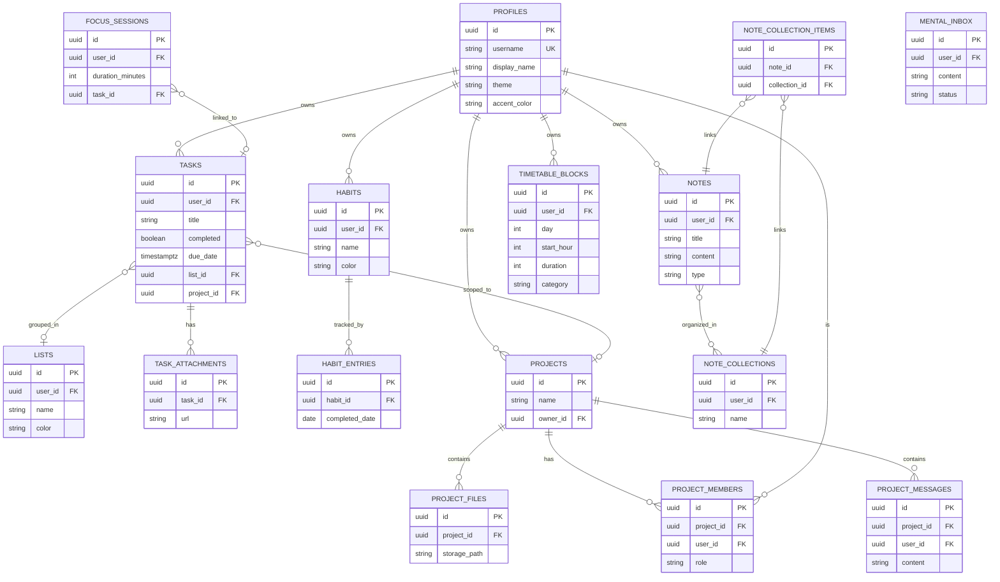

# Data Models and Database Schema

Peak Hub uses a robust relational PostgreSQL database hosted by Supabase. The schema consists of 28 tables organized into distinct domains. 

All tables strictly enforce **Row Level Security (RLS)** to guarantee data privacy and tenant isolation.

## Entity-Relationship Diagram (ERD)

The following Mermaid diagram illustrates the relationships between the core entities across the major domains (User, Tasks, Habits, Nexus, Workspace, Timetable, Focus).

## Schema Details

### User Domain
- **`profiles`**: Tied 1:1 with `auth.users`. Stores visual preferences (`theme`, `accent_color`, `compact_mode`) and identity (`username`, `display_name`). `username` is constrained to be unique globally.

### Task Domain
- **`tasks`**: Central entity for to-dos. Can be personal (`project_id` is null) or collaborative (`project_id` is set). Supports rich descriptions, priority flags, and due dates.
- **`lists`**: Custom folders/spaces created by users to group personal tasks.
- **`task_attachments`**: Metadata for files uploaded to Supabase Storage and linked to a task.

### Habit Domain
- **`habits`**: Definitions of daily tracking goals. Supports manual sorting (`position`) and soft-deletion (`archived`).
- **`habit_entries`**: A log of completion. A composite UNIQUE constraint on `(habit_id, completed_date)` ensures a habit is only marked once per day.

### Nexus (Notes) Domain
- **`notes`**: Markdown documents. Includes arrays for `tags` and metadata for `type` (e.g., standard, daily journal).
- **`note_collections` & `note_collection_items`**: Enables a many-to-many relationship allowing notes to exist in multiple folders/notebooks simultaneously.
- **`note_versions`**: Snapshots of notes for history tracking.
- **`public_note_shares`**: Manages unique slugs for publicly shared notes.

### Timetable Domain
- **`timetable_blocks`**: Defines the weekly schedule. Uses CHECK constraints to ensure `day` is 0-6, `start_hour` is 0-23, and `duration` is valid.
- **`deadlines`**: Arbitrary date markers visualized on the timetable.

### Focus Domain
- **`focus_sessions`**: Records historical data of completed deep work sessions (duration, intention, completion state).
- **`session_memories`**: 1:1 link between a focus session and a post-session reflection note.
- **`mental_inbox`**: Stray thoughts captured during focus or via quick capture, pending triage.

### Workspace Domain
- **`projects`**: The root collaborative entity. Generates a UNIQUE `invite_code`.
- **`project_members`**: Junction table assigning roles (owner, member, viewer) to users within a project.
- **`project_messages`**: Real-time chat logs. Contains a `deleted` flag for soft-deletion and `attachments` JSONB for inline files.
- **`project_invites`**: Ephemeral table for pending email invitations with secure tokens and expiration dates.
- **`project_folders` & `project_files`**: Hierarchical file storage metadata.

## Database Constraints & Indexes
- **Indexes**: Added to frequently joined or filtered columns, primarily foreign keys (e.g., `idx_tasks_project_id`, `idx_project_members_user_id`).
- **Check Constraints**: Enforce domain logic directly in the DB (e.g., `project_members_role_check` restricts roles to 'owner', 'member', 'viewer').
- **RLS**: Every table has policies enforcing access. Typically: `user_id = auth.uid()` for personal data, and complex subqueries against `project_members` for collaborative data.
