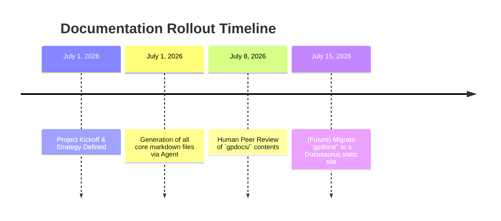

# Documentation Strategy & Execution Plan

This document summarizes the overarching documentation strategy for the Peak Hub (Vibecoded) app.

## Prioritized Documentation Checklist

1. [x] **Project Overview & README**: (`README.md`) Drafted clear intro, tech stack, and setup instructions.
2. [x] **Architectural Diagrams**: (`ARCHITECTURE.md`) Created high-level system and module-level frontend Mermaid diagrams.
3. [x] **Codebase Inventory**: (`INVENTORY.md`) Listed languages, frameworks, folder structure, and key libraries.
4. [x] **Data Models**: (`DATA_MODELS.md`) Documented schema with Mermaid ER diagram and table descriptions.
5. [x] **API Specs**: (`API_SPECS.md`) Enumerated Edge Function endpoints and Supabase JS query patterns.
6. [x] **User Flows & Features**: (`FEATURES.md`) Outlined major user journeys and acceptance criteria.
7. [x] **Setup/Onboarding Guide**: (`SETUP_ONBOARDING.md`) Step-by-step local dev instructions.
8. [x] **CI/CD Pipeline & Deployment**: (`CI_CD_DEPLOYMENT.md`) Documented automated build/test/deploy steps and Vercel hosting.
9. [x] **Monitoring & Logging**: (`CI_CD_DEPLOYMENT.md` / `TROUBLESHOOTING.md`) Detailed monitoring alerts and log access.
10. [x] **Coding Standards**: (`CODING_STANDARDS.md`) Defined style guidelines, branching, and PR processes.
11. [x] **Testing Guidelines**: (`TESTING_STRATEGY.md`) Explained test suite structure and coverage targets.
12. [x] **Security Notes**: (`SECURITY_PERFORMANCE.md`) Documented auth mechanisms and RLS security.
13. [x] **Troubleshooting Guide**: (`TROUBLESHOOTING.md`) Summarized known issues and operational runbook.
14. [x] **Contribution Section**: (`CONTRIBUTING.md`) Wrote guidelines and roadmap.
15. [x] **Templates**: (`TEMPLATES.md`) Provided templates for README, CHANGELOG, PRs, and ADRs.

## Recommended Tools for Future Expansion

As the documentation scales, the team should consider migrating these markdown files to a Static Site Generator.

| Category | Recommended Tool | Pros | Cons |
|---|---|---|---|
| **Docs Site** | Docusaurus | React-based, native MDX, excellent search/versioning out of the box. Ideal since the team already knows React. | Slightly heavier setup than basic markdown. |
| **Diagramming** | Mermaid.js | Native markdown integration (used currently). Perfect for Docs-as-Code. | Less customizable than GUI tools. |
| **Hosting** | Vercel | Seamless integration with GitHub, handles both the Vite app and Docusaurus sites perfectly. | |

## Documentation Generation Prompt

*(This prompt was used as the blueprint for generating this suite via an AI Agent)*

```text
System: You are a technical documentation AI.
Context: The project is "Peak Hub", a React 19/Vite SPA backed entirely by Supabase (Postgres, Auth, Edge Functions). It uses Tailwind v4, Zustand, and Framer Motion. Key domains: Tasks, Habits, Timetable, Focus Timer, Nexus Notes, Collaborative Workspaces.
Task: Generate a comprehensive documentation suite in the `gpdocs/` folder based on the 15-point checklist provided in the Documentation Strategy brief. Ensure all files use strict Markdown formatting, include Mermaid diagrams where applicable (Architecture, ERD), and explain the *why* alongside the *what*.
```

## Rollout Timeline


